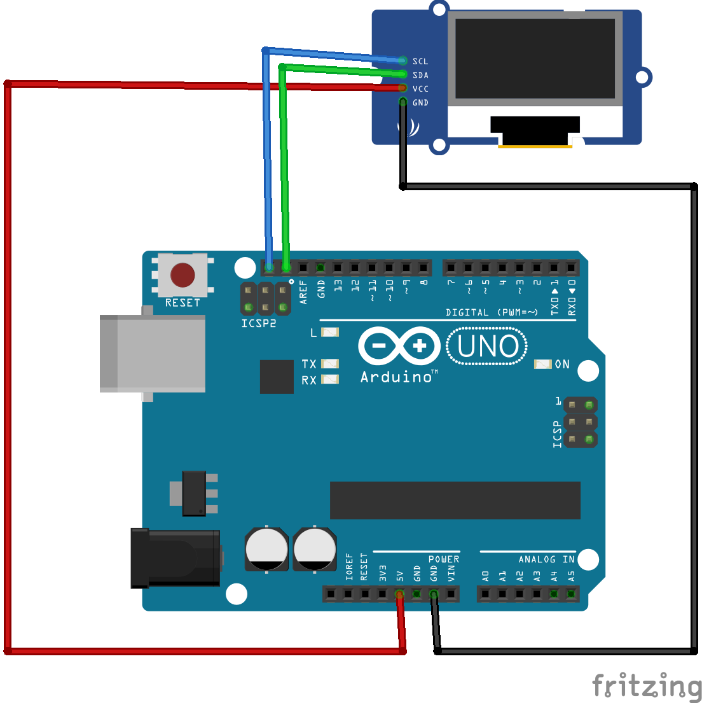

# Interfacing SH1106 based 1.3 Inch I2C OLED Display Module with Arduino

# Connections and Pin wiring
Because the OLED display uses I2C communication protocol, wiring is very simple. You just need to connect to the Arduino Uno I2C pins as shown in the table below.

**Pin Wiring to Arduino Uno**  
|Display| Controller|
|-|-|
|Vin |	5V |
| GND|	GND|
|SCL |	SCL or A5 |
| SDA	| SDA or A4 |


   

If you’re using a different Arduino board, make sure you check the correct I2C pins:

Nano: SDA (A4); SCL (A5);   
MEGA: SDA (20); SCL (21);  
Leonardo: SDA (20); SCL (21);  

## Important Notes
1.3 inch OLED Display Module based on I2C 128X64 OLED SH1106 require the following: 
* Include the `U8glib.h`
    ```c++
    #include "U8glib.h"
    ```
* I2C addess is 0x3C
    ```c++
    #define i2c_Address 0x3c
    ```

* U8g constructor   
    ```c++
    U8GLIB_SH1106_128X64 u8g(U8G_I2C_OPT_NONE);
    ```

# Working with  `U8glib` (Universal 8x8 Graphics Library)
In Arduino IDE `Tools` menu go to  `Manage Libraries...`. In the search bar search for `U8glib` by Oliver and install all libraries. 
Optional References:  
* https://code.google.com/archive/p/u8glib  
* https://github.com/olikraus/u8glib  
* https://github.com/olikraus/U8glib_Arduino/releases  
* https://content.instructables.com/FPD/9MOK/IWMR3N28/FPD9MOKIWMR3N28.zip  

## Hello World Examples
`File` -> `Examples` -> `U8glib` -> `HelloWorld`
Uncomment the following line
```c++
U8GLIB_SH1106_128X64 u8g(U8G_I2C_OPT_NONE);	// I2C / TWI 
```
Compile, load and run the program to UNO

You may try other examples like `U8g Logo` etc


# Working with `Adafruit` SH110X Library
In Arduino IDE `Tools` menu go to  `Manage Libraries...`. In the search bar search for `Adafruit SH110X` and install all libraries. 
* Adafruit GFX Library@1.11.5
* Adafruit SH110X@2.1.8 

Once done look for `Adafruit SH110X` under the `File` menu go to `Examples`. In that pick the following sktech
Adafruit_SH110X -> OLED_QTPY_SH1106 -> SH1106_128x64_i2c_QTPY

**Note: double check the following lines:** 
```c++
#define i2c_Address 0x3c //initialize with the I2C addr 0x3C Typically eBay OLED's
#define SCREEN_WIDTH 128 // OLED display width, in pixels
#define SCREEN_HEIGHT 64 // OLED display height, in pixels
#define OLED_RESET 4   //   QT-PY / XIAO  <--- THIS LINE MAY NOT BE CORRECT OUT OF THE BOX -->
Adafruit_SH1106G display = Adafruit_SH1106G(SCREEN_WIDTH, SCREEN_HEIGHT, &Wire, OLED_RESET);
```

Compile, load and run the program to UNO


## YouTube Videos
https://www.youtube.com/watch?v=UlYrnUYpkl4&ab_channel=SaravananAL  
https://www.youtube.com/watch?v=hjM0dLTwoIU&ab_channel=TechVegan  

## Other Tutorials
https://www.buydisplay.com/i2c-blue-1-3-inch-oled-display-module-128x64-arduino-raspberry-pi
